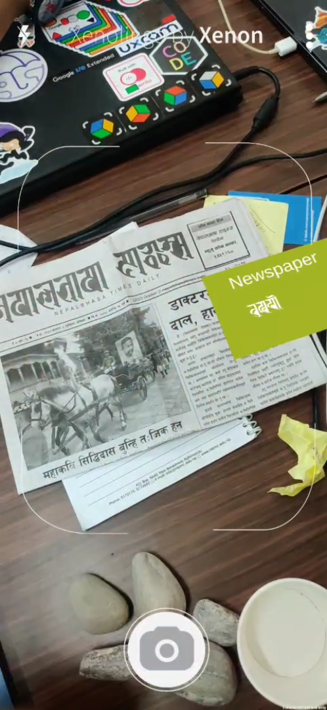
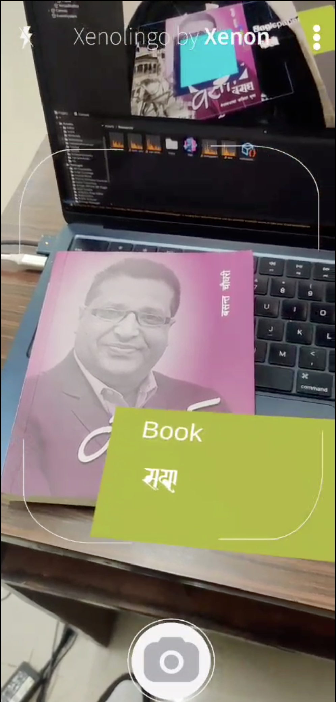

# XenoLingo

XenoLingo is an innovative project with a dual mission: preserving indigenous languages and fostering language learning. This is made possible through the seamless integration of two fundamental components: object detection and a Text-to-Speech (TTS) system for articulate language expression. By harnessing the device's camera, XenoLingo empowers users to recognize real-world objects in real-time. When users point their devices at objects, XenoLingo identifies them and provides labels in both the user's native language script and English, facilitating better comprehension. Additionally, it offers pronunciation through speech. 

## Installation
To get started with XenoLingo, simply install the APK file on your Android device. During the installation process, grant permissions for camera access. Once the installation and permissions are set up, users can begin using the application.
## Overview

  
  
  

## Features
- **Immersive Learning:** XenoLingo creates an immersive language learning experience by integrating AR technology, allowing users to interact with real-world objects.
- **Object Recognition:** XenoLingo recognizes real-world objects when users point their device's camera at them.
- **Multilingual Object Labeling:** Objects are labeled in both the user's native language script and English for enhanced understanding.
- **Seamless Digital Overlay:** Digital content overlays real-world objects seamlessly, enhancing the user experience.
- **Pronunciation Assistance:** It includes a Text-to-Speech (TTS) system, enabling users to hear accurate pronunciation of object names in their native language.
- **Educational Tool:** It can be used in schools, cultural centers, and language preservation initiatives for educational purposes.
- **Offline Mode:** XenoLingo works seamlessly even without an internet connection, ensuring accessibility in various environments.

Feel free to Contribute. Make sure to read [CONTRIBUTING GUIDELINES](./CONTRIBUTING.md) and [CODE OF CONDUCT](./CODE_OF_CONDUCT.md) before making a pull request.
## References

[1] S. Khadka, R. G.C., P. Paudel, and R. Shah, "Nepali Text-to-Speech Synthesis using Tacotron2 for Melspectrogram Generation." Available: [ShrutiAudio GitLab Repository](https://gitlab.com/shrutiaudio/shrutiaudio).  
[2] T. L. Manandhar,  Modern Language Of Kathmandu Valley, D. A. Vergati, Ed.  Agam Kala  Prakashan, 1986.  
[3] M.B. Shakya, "Prachalit, Ranjana and Bhujinmol Scripts"  
